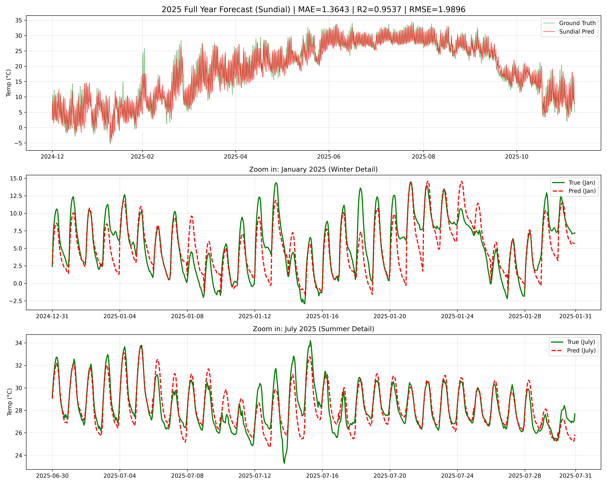
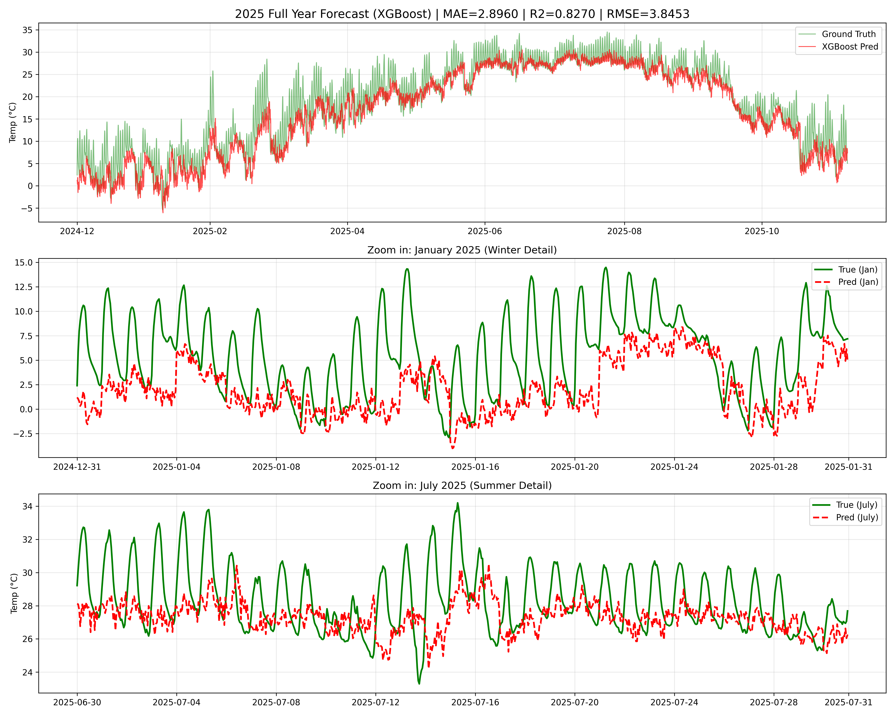
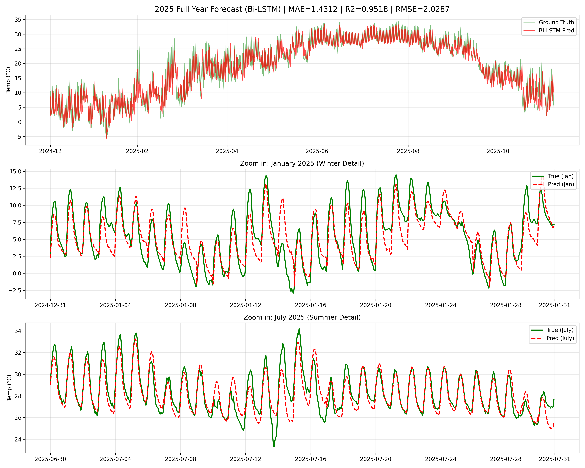
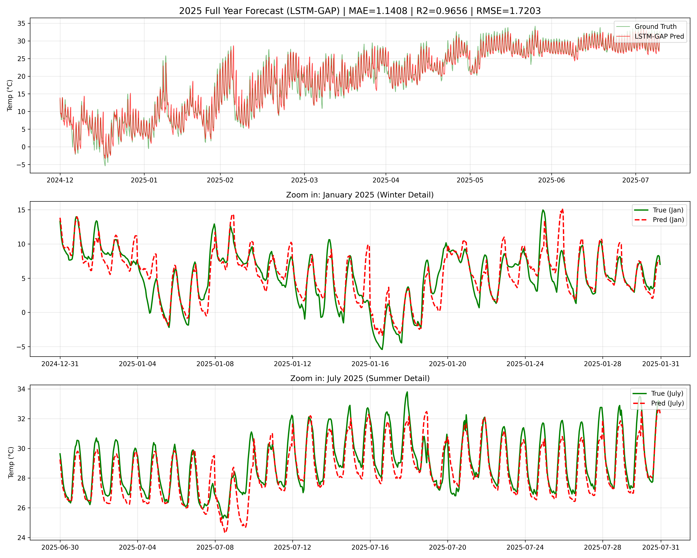
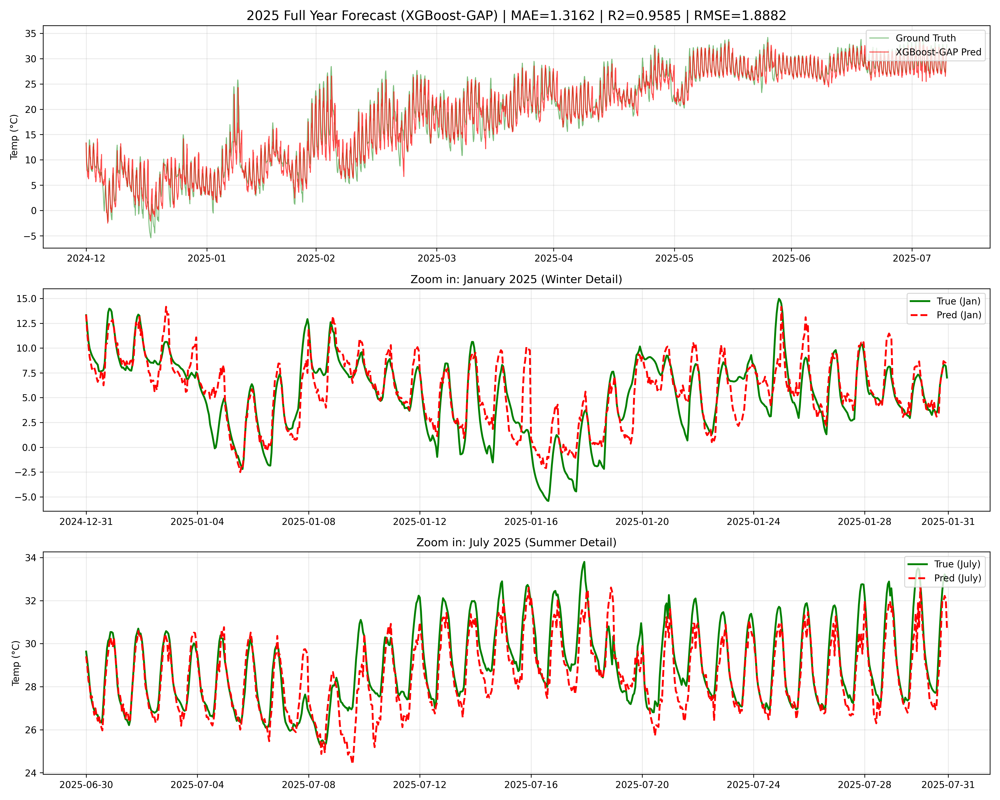
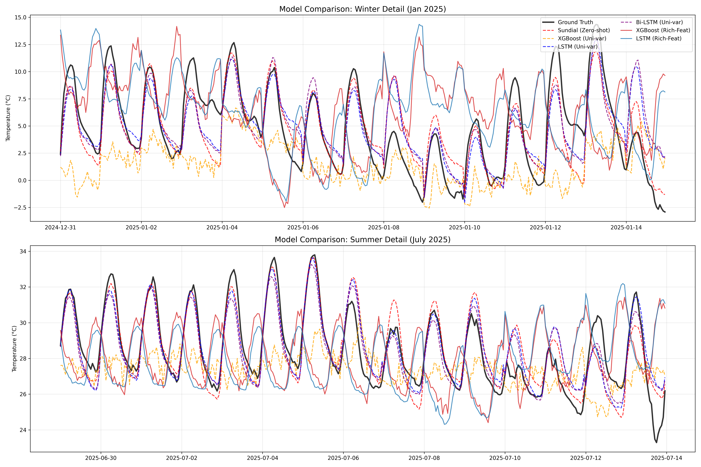
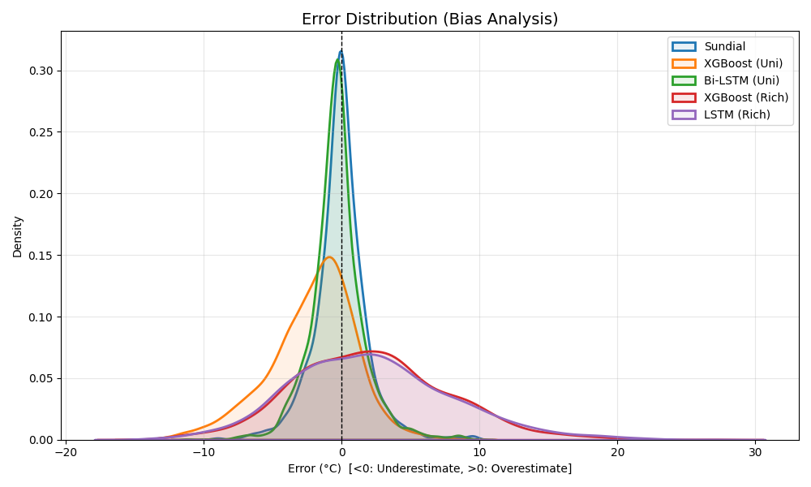
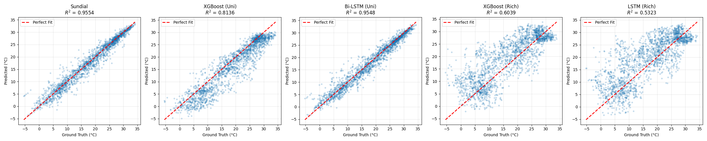
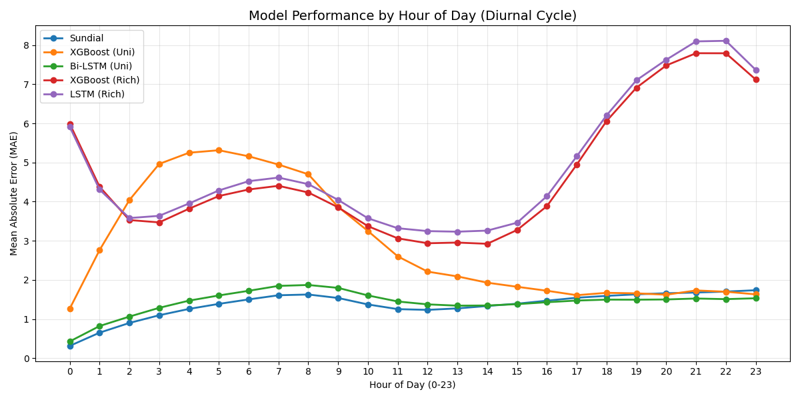

# PJ17 气温预测
·针对气温时序非线性、周期性特征，使用传统机器学习模型LSTM、XGboost，使用基于transformer架构的Sundial模型，以上海2010-2025年气象数据进行训练并验证，对比MAE、RMSE、R²。
```
├── README.md
├── Sundial
│   ├── LICENSE
│   ├── README.md
│   ├── examples
│   └── figures
├── data
│   ├── logs
│   ├── processed
│   └── raw
├── environment.yml
├── models
│   └── checkpoints
├── requirements.txt
├── results
│   ├── figures
│   ├── logs
│   ├── metrics
│   └── models
├── scripts
│   ├── data_processing
│   ├── model
│   └── utils
└── structure.txt
```
```
环境依赖
pip install -r requirements.txt
or
pip install -r requirements.txt -i https://pypi.tuna.tsinghua.edu.cn/simple
# 1. 从yml文件创建环境
conda env create -f environment.yml
# 2. 激活创建好的环境
# Linux/macOS
conda activate sundial_v2
# Windows
activate sundial_v2
```
数据集-单变量
```
- 2010-2025 time temperature 仅时间、气温
/root/autodl-tmp/project/mlpj/data/processed/shanghai_2010_2025.csv
/root/autodl-tmp/project/mlpj/data/processed/shanghai_2010_2025_full.npy
```

数据集-多变量
（因数据集下载巨慢，故为了尽快完成实验，利用了已下载的2010-2014年的数据【训练集】，2025年的【测试集】）
```
# 数据处理
# /root/autodl-tmp/project/mlpj/scripts/data_processing/batch_process_data.py

# 处理后的数据
# /root/autodl-tmp/project/mlpj/data/processed/train_2010_2014_rich.csv
# /root/autodl-tmp/project/mlpj/data/processed/test_2025_rich.csv
--- 提取 7 大特征 ---
    # 1. 气温 (K -> C)
    t2m = ds['t2m'].mean(dim=['latitude', 'longitude']).values - 273.15
    # 2. 露点 (K -> C)
    d2m = ds['d2m'].mean(dim=['latitude', 'longitude']).values - 273.15
    # 3. 降雨 (m -> mm)
    tp  = ds['tp'].mean(dim=['latitude', 'longitude']).values * 1000
    # 4. 气压 (Pa -> hPa)
    sp  = ds['sp'].mean(dim=['latitude', 'longitude']).values / 100
    # 5. 辐射 (J/m2)
    ssrd= ds['ssrd'].mean(dim=['latitude', 'longitude']).values
    # 6. 土壤水 (0-1)
    swvl1=ds['swvl1'].mean(dim=['latitude', 'longitude']).values
    # 7. 风速 (合成 m/s)
    u10 = ds['u10'].mean(dim=['latitude', 'longitude']).values
    v10 = ds['v10'].mean(dim=['latitude', 'longitude']).values
    wind = np.sqrt(u10**2 + v10**2)
- time,t2m,d2m,tp,sp,ssrd,swvl1,wind
- 2010-01-01 00:00:00,0.8779907,-2.374298,0.0004351138,1022.69745,13011058.0,0.31365156,2.900115
- 2010-01-01 01:00:00,4.141327,-1.2516785,0.0,1022.7929,841104.0,0.31358036,3.459127
- 2010-01-01 02:00:00,6.1471252,-1.2593994,0.0,1022.6156,2273333.0,0.3132502,4.278056
- 2010-01-01 03:00:00,7.595581,-1.3978271,0.0,1021.60626,4145655.2,0.3126364,4.4589424
-······················································································
```
## Sundial

调用sundial对气温进行预测，参数如下
```
# /root/autodl-tmp/project/mlpj/scripts/model/run_sundial2predict.py
from transformers import AutoModelForCausalLM

def set_seed(seed=42):
    random.seed(seed)
    np.random.seed(seed)
    torch.manual_seed(seed)
    torch.cuda.manual_seed(seed)
    torch.cuda.manual_seed_all(seed)
    torch.backends.cudnn.deterministic = True
    torch.backends.cudnn.benchmark = False
set_seed(42)
# 标准化参数
context_len = 512
pred_len = 24
stride = 24
```
|MAE |MSE|rmse|R^2|
|----|----|----|----|
|1.3643|3.96587|1.9896|0.9537|

<p align="center">

</p>

# XGBoost

```
# /root/autodl-tmp/project/mlpj/scripts/model/run_xgboost2predict.py

xgb_params = {
    'n_estimators': 800,
    'learning_rate': 0.05,
    'max_depth': 8,
    'objective': 'reg:squarederror',
    'n_jobs': -1,
    'tree_method': 'hist',
    'device': 'cuda'  
}

```
|MAE |MSE|rmse|R^2|
|----|----|----|----|
|2.8960|14.7865|3.8453|0.8270|
<p align="center">

</p>

# LSTM

```
# 训练参数
batch_size = 256
epochs = 50 
learning_rate = 0.001
hidden_size = 128
num_layers = 2

class LSTMModel(nn.Module):
    def __init__(self, input_size=1, hidden_size=128, num_layers=2, output_size=24):
        super(LSTMModel, self).__init__()
        self.lstm = nn.LSTM(input_size, hidden_size, num_layers, batch_first=True, dropout=0.1)
        self.fc = nn.Linear(hidden_size, output_size)
        
    def forward(self, x):
        # x: (batch, seq, feature)
        lstm_out, _ = self.lstm(x)
        last_step_out = lstm_out[:, -1, :] 
        predictions = self.fc(last_step_out)
        return predictions

model = LSTMModel(hidden_size=hidden_size, num_layers=num_layers).to(device)
criterion = nn.MSELoss()
optimizer = torch.optim.Adam(model.parameters(), lr=learning_rate)
```
|MAE |MSE|rmse|R^2|
|----|----|----|----|
|1.3294|3.6409|1.9081|0.9574|

<p align="center">

</p>

# Bi-LSTM


```
# 训练参数
batch_size = 256
epochs = 50 
learning_rate = 0.001
hidden_size = 128
num_layers = 2

class BiLSTMModel(nn.Module):
    def __init__(self, input_size=1, hidden_size=128, num_layers=2, output_size=24):
        super(BiLSTMModel, self).__init__()
        self.lstm = nn.LSTM(input_size, hidden_size, num_layers, batch_first=True, dropout=0.1, bidirectional=True)
        self.fc = nn.Linear(hidden_size * 2, output_size)
        
    def forward(self, x):
        # x: (batch, seq, feature)
        # lstm_out: (batch, seq, hidden_size * 2)
        lstm_out, _ = self.lstm(x)
        last_step_out = lstm_out[:, -1, :] 
        predictions = self.fc(last_step_out)
        return predictions

model = BiLSTMModel(hidden_size=hidden_size, num_layers=num_layers).to(device)
criterion = nn.MSELoss()
optimizer = torch.optim.Adam(model.parameters(), lr=learning_rate)

```
|MAE |MSE|rmse|R^2|
|----|----|----|----|
|1.4312|4.1158|2.0287|0.9518|

<p align="center">

</p>

# 基于多变量
# LSTM
使用七个特征进行训练，效果获得**提升**

```
# /root/autodl-tmp/project/mlpj/scripts/model/run_lstm_gap_2025.py

context_len = 512
pred_len = 24
input_size = 7   # 7个气象特征
hidden_size = 128
num_layers = 2
batch_size = 256
epochs = 50 
learning_rate = 0.001

class LSTMModel(nn.Module):
    def __init__(self, input_sz, hidden_sz, layers, out_sz):
        super(LSTMModel, self).__init__()
        self.lstm = nn.LSTM(input_sz, hidden_sz, layers, batch_first=True, dropout=0.1)
        self.fc = nn.Linear(hidden_sz, out_sz)
        
    def forward(self, x):
        out, _ = self.lstm(x)
        return self.fc(out[:, -1, :])

model = LSTMModel(input_size, hidden_size, num_layers, pred_len).to(device)
criterion = nn.MSELoss()
optimizer = torch.optim.Adam(model.parameters(), lr=learning_rate)

```

|MAE |MSE|rmse|R^2|
|----|----|----|----|
|1.1408|2.9594|1.7203|0.9656|

<p align="center">

</p>


# XGBoost
使用七个特征进行训练，效果获得**提升**

```
# /root/autodl-tmp/project/mlpj/scripts/model/run_xgboost_gap_2025.py

xgb_params = {
    'n_estimators': 800,
    'learning_rate': 0.05,
    'max_depth': 8,             # 树深
    'objective': 'reg:squarederror',
    'n_jobs': -1,
    'tree_method': 'hist',      
    'device': 'cuda',           
    'colsample_bytree': 0.6     # 每次只用 60% 的特征，防止过拟合
}

```
|MAE |MSE|rmse|R^2|
|----|----|----|----|
|1.3162|3.5653|1.8882|0.9585|

<p align="center">

</p>

# Conculsion
|Model|MAE |MSE|rmse|R^2|
|---|----|----|----|----|
|Sundial(Zero-shot)|1.3643|3.96587|1.9896|0.9537|
|XGBoost(Uni-var)|2.8960|14.7865|3.8453|0.8270|
|LSTM(Uni-var)|1.3162|3.5653|1.8882|0.9585|
|Bi-LSTM(Uni-var)|1.4312|4.1158|2.0287|0.9518|
|LSTM(Rich-Feat)|1.1408|**2.9594**|**1.7203**|**0.9656**|
|XGBoost(Rich-Feat)|**1.3162**|3.5653|1.8882|0.9585|


将六个模型的预测结果进行对比

```
/root/autodl-tmp/project/mlpj/scripts/model/compare_all_models.py
```
<p align="center">

</p>

# At
图1：analysis_error_dist.png
```
看峰值位置：如果 XGBoost 的峰值正好在 0，说明它非常精准。如果 LSTM 的峰值在 -0.5，说明它整体偏冷。
看宽度：峰越尖越好。宽峰代表模型预测很不稳定。
```
<p align="center">

</p>
图2：analysis_scatter.png (散点回归)
```
看离群点：注意看左下角（极冷）和右上角（极热）。如果点偏离了红色对角线，说明模型无法捕捉极端天气。
通常 XGBoost 在两端收敛得更好，而 LSTM 可能会发散。
```
<p align="center">

</p>
图3：analysis_hourly_error.png (分时误差) —— 重点

```
看波形：通常误差最高的时刻是 8:00-10:00（升温最快时）和 17:00-19:00（降温最快时）。
对比：如果 LSTM 在这两个时段误差激增，说明它存在严重的滞后性 (Lag)。如果 XGBoost 曲线比较平，说明它通过物理特征（辐射/风速）成功克服了滞后。如果 Sundial 在中午误差大，说明它低估了最高气温。
```
<p align="center">

</p>

# Reference
```
@article{liu2025sundial,
  title={Sundial: A Family of Highly Capable Time Series Foundation Models},
  author={Liu, Yong and Qin, Guo and Shi, Zhiyuan and Chen, Zhi and Yang, Caiyin and Huang, Xiangdong and Wang, Jianmin and Long, Mingsheng},
  journal={arXiv preprint arXiv:2502.00816},
  year={2025}
}

```